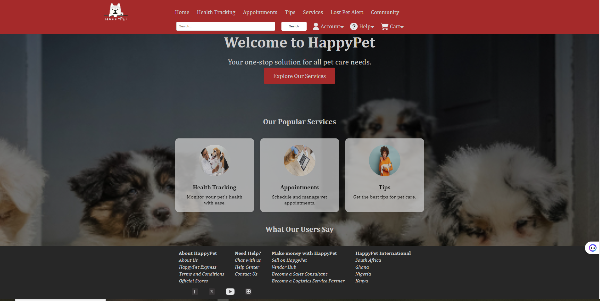

# Happy Pets Web Application
Happy Pet Portfolio is a web application built with Python Flask framework. This application allows users to create and manage profiles for their pets, including photos, descriptions, and other details. It connects Pet owners to Vet doctors and enables vet doctors to easily track the health records of a pet to know the right approach when treating a pet due to its medical records. Happy provides an all round solution to enable pet owners easily care for their pets, document and follow up details of their pets. This project aims to provide an alll round care solution for pets in Nigeria, Kenya, Ghana and South Africa.

### Explanation

- **Title and Project Description**: Provides a clear name and a brief overview of what the project does.
- **Table of Contents**: Helps users quickly find the information they need.
- **Installation**: Step-by-step guide on how to set up the project locally.
- **Usage**: Instructions on how to run and use the project.
- **Features**: Highlights the key features of the project.
- **Contributing**: Guidelines for contributing to the project.
- **Contributors**: Lists contributors to this project.
- **Models**: Describes the models in this project.
- **Routes**: Describes the routes in this project.
- **Authors**: Lists the authors of this project.
- **License**: Specifies the license under which the project is distributed.

## Table of Contents
1. [ Installation. ](#installation)<br>
2. [ Usage.](#usage)<br>
3. [ Features. ](#features)<br>
4. [Technologies. ](#technologies)<br>
5. [Contributing. ](#contributing)<br>
6. [Contributors. ](#contributors)<br>
7. [ Models. ](#models)<br>
8. [ Routes. ](#routes)<br>
9. [ Authors. ](#authors)<br>
10. [License](#licence)

## Installation

1. **Clone the repository**:
    ```bash
    git clone https://github.com/yourusername/happy-pet-portfolio.git
    cd happy-pet-portfolio
    ```

2. **Create a virtual environment**:
    ```bash
    python -m venv venv
    source venv/bin/activate  # On Windows, use `venv\Scripts\activate`
    ```
    

3. **Install dependencies**:
    ```bash
    pip install -r requirements.txt
    ```

4. **Set up the database**:
    ```bash
    flask db init
    flask db migrate -m "Initial migration"
    flask db upgrade
    ```


## Features
. User authentication
. Profile creation and management
. Uplaod and display pet photos
. Responsive design
. Add Pet Health Records
. Book Vet Appointments

## Usage

To run the project locally, use the following command:
```bash
python3 app.py
```

## Requirements

- Python 3.x
- Flask
- Flask-Login
- Flask-WTF
- Flask-SQLAlchemy
- email_validator
- Flask-Caching
- Flask-WTF
- Jinja2
- requests
- SQLAlchemy
- Werkzeug
- WTForms

## Technologies
### Frontend Technologies
- HTML
- CSS
- JavaScript
- JQuery
- Jinja2

### Backend Technologies
- Python3
- Flask
- Flask-SQLAlchemy
- Flask-Login

### Database
-MySQL

## Contributing

1. Fork the repository
2. Create your feature branch (`git checkout -b feature/your-feature`)
3. Commit your changes (`git commit -am 'Add some feature'`)
4. Push to the branch (`git push origin feature/your-feature`)
5. Create a new Pull Request


## Contributors
- Samuel Dennis (frontend and backend developer)
    * Team Lead
    * Project manager
    * Coordinating the breakdown of tasks, task delegation
    * Design and development of frontend and backend routes

- Holy Ovwiurhobo (Frontend and Backend developer)
    * Lead developer
    * Design of Project file structure
    * Gathering of project technical requirements
    * Design of User Object Model
    * Frontend and Backend Routes development

- Idah Khumalo (Frontend and Backend developer)
    * Design and description of Project Features
    * Design and description of project routes
    * Design and Development of Base Frontend File
    * Design of user interface and experience design
    * Frontend and backend routes development

- Charles Okechukwu (Frontend and backend developer)
    * Design and development of Pet object model
    * Design of health tracker page
    * Design of Vet object model
    * Frontend and backend routes development


## Models
### User Model
User model object handles the storage of user's data. It enables users to reigister, login, add pet and book appointments. It contains the following fields:
- First Name
- Last Name
- Email
- Phonenumber
- Password
- Created At

### Pet Model
Pet model object handles the storage of the pet's data. It enables users to add their pets and upload pet's photo, it contains a method pet_age that calculates the pet's age in years. It contains the following fields:
- Name
- Specie
- Breed
- Birth Date
- Color
- Owner Id
- Photo

### Vet Model
Vet object model handles the storage of vet doctors data. It enables vet doctors to register, login and attend to vet appointments and start vet session. It contains the following fields:
- Fullname
- Email
- Phonenumber
- Address
- City
- State
- Country
- Password
- Photo


### Appointments
Appointments object model handles the appointment data, it collects the appointment time, reason for apointment and also collects the pet id, pet name, owner's contact details and the vet doctors id.


### Vaccination
Vaccination object model handles the vaccination records, it stores the vaccine name, vaccine does, date of vaccine administration, date of next vaccine administration, number of doeses left and the name of the vet doctor administering the vaccine.


### HealthRecord
HealthRecord object model handles the health record of a pet, it stores the diagnosis, sysmptoms, treatment and name vet doctor treating the pet.

### GrowthRecord
GrowthRecord object model handles the growth record of the pet, it stores the weight and height of a pet month by month in a year.


## Routes
### Home route
```/```



Happy Pet Home page is the page displayed when a client visits the root route


### Register Routes
```/register```
```/vet/register```


HappyPet has two register routes, ```/register``` handles registration for users while ```/vet/register``` handles registration for the vet doctors.


### Login Routes
```/login```
```/vet/login```

HappyPet has two login routes, ```/login``` handles user login and ```/vet/login``` handles login for vet doctors.


### Add Pet Route
```/pet/add```


This route handles the addition of pet to database, this enables the user to add his pet to a database


### Appointment Route

```/create_appointment```


Creates appointment for a pet with a vet doctor


### Health Tracker Route

```/health/<pet_id>```


This route handles the display of the vaccination records, health records, appointments and growth records


### Vet Dashboard Route

```/vet```


This route displays the vet dashboard which displays the current appointemnes a vet doctor has and a start session button.


### Vet Session Route

```/vet/session/<pet_id>/<a_id>```


This route starts a vet session, this is the start of the vet doctors meeting with the pet, the vet doctor would be able to view the pet's health record by clicking on the view health record button, the vet doctor can also update finings in the health of the pet by clicking the add health record button, the vet can also add vaccination and growth records. When the vet doctor is done with the meeting, he/she clicks on the end session button which ends the session and deletes the appointment records.

### Add Vaccination Route

```/vet/add/vaccination/<a_id>```

This route adds the pet vaccinationation record, the pet vaccination record can only be added by a vet doctor, the user can only view the pet vaccination record.


### Add Health Record

```/vet/add/health_record/<a_id>```

This route adds the pet's health record, this is also added by the vet doctor while the user can only view the record added.


### Add Growth Record

```/vet/add/growth_record/<a_id>```

This route adds the pet's growth record which includes the height and weight of the pet, this record is added each month and is used to track the growth of the pet for each year.


### End Session

```/vet/session/<a_id>/end```

This route end's the current vet session and returns the vet doctor to his/her dashboard to start a session for the next appointment, it delets the session object enabling the vet doctor to create a new session.


## Authors
1. Holy Ovwiurhobo (oghenewonaholy@gmail.com)
2. Idah Khumalo (lindiwekhumalo833@gmail.com)
3. Samuel Dennis (sam.dben@gmail.com)
4. Charles Okechukwu (realcharlieok@gmail.com)


## License
This project is licensed under the MIT License. See the LICENSE file for more information.